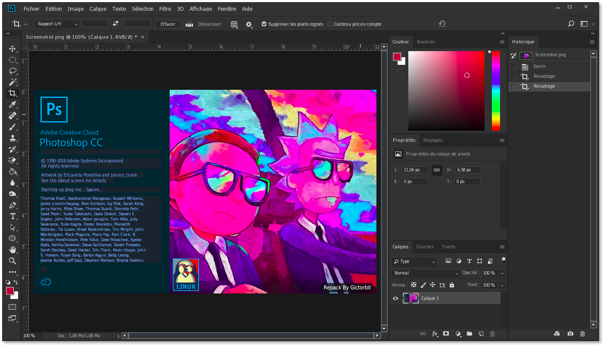

<div align="center" class="tip" markdown="1" style>



 
  
</div>

# Photoshop2Linux
Ce script installe Adobe Photoshop CC 2018 sur Linux en utilisant Wine et définit certains composants nécessaires pour de meilleures performances

## :rocket: Fonctionnalitées
* Télécharge les composants nécessaires et les installe  (`vcrun`,`atmlib`,`msxml`...)
* Télécharge le programme d'installation de photoshop et l'installe automatiquement
* Crée des commandes photoshop et une entrée de bureau
* Configure le Wine pour le mode sombre afin d'intégrer visuellement photoshop dans Wine
* Détecte les diverses cartes graphiques comme (`Intel`,` Nvidia` ...)
* Enregistre les fichiers téléchargés dans un dossier caché dans votre répertoire d'utilisateur
* C'est gratuit et vous n'aurez besoin d'aucune clé de licence
* Fonctionne sur toutes les distributions de Linux

## :warning: Requirement
1- Avoir un processeur sous architecture x64 et utiliser une version de linux sous x64

2- Assurez-vous que les packages ci-dessous sont déjà installés sur votre distribution Linux
* `wine`
* `winetricks`
* `aria2c`
* `md5sum`


S'ils ne sont pas déjà installés, vous pouvez les installer en utilisant votre gestionnaire de paquets (example avec apt-get)
```bash
sudo apt-get install wine aria2
``` 
3- Assurez-vous d'avoir un minimum de 5 Go dans votre partition `/home`
> 1 Go sera libéré à la fin de l'installation

4- Assurez-vous d'avoir une connexion Internet et de pouvoir consommer environ 1,5 Go pour télécharger Photoshop et ses composants pour la première fois

## :computer: Installation

Il y a deux scripts d'installation

* `PhotoshopSetup.sh`
* `PhotoshopSetupCustom.sh`

Les scripts d'installation automatiquent utilisent un lecteur virtuel de wine et créent un nouveau `winprefix` pour Photoshop

vous devez d'abord cloner le dépot gitub avec cette commande:
```bash
git clone https://github.com/MatisseAG/Photoshop2Linux.git
cd Photoshop2Linux
```
Puis exécutez le script `setup.sh` pour installer Photoshop sur votre distribution Linux

```bash
chmod +x setup.sh
./setup.sh
```
<div align="center" class="tip" markdown="1" style>


</div>

Lors de l'installation, veuillez faire attention aux messages d'erreur qui peuvent résoudre un éventuelle problème

> **NOTE :** Assurez-vous de séléctionnez Windows 7 dans la fenêtre de Wine pendant l'installation


<details>
<summary>more details</summary>

Pour l'installation des composants, vous avez deux options, en utilisant winetricks ou en utilisant une méthode personnalisée.

### :one: Installation en utilisant winetricks (Recommandé)
Pour installer Photoshop automatiquement avec le script winetricks, il suffit d'exécuter le script bash avec la commande ci-dessous pour qu'il télécharge et installe Photoshop avec ses composant en utilisant et en configurant automatiquement wine

```bash
chmod +x PhotoshopSetup.sh
./PhotoshopSetup.sh
```

### :two: Installation en utilisant le script personnalisé
Pour installer Photoshop avec le script personnalisé, il suffit d'exécuter le script bash avec la commande ci-dessous pour qu'il télécharge et installe Photoshop avec ses composant en utilisant et en configurant automatiquement wine

```bash
chmod +x PhotoshopSetupCustom.sh
./PhotoshopSetupCustom.sh
```

</details>


## :wine_glass: Configuration de wineprefix
Si vous avez besoin de configurer wineprefix pour Photoshop, vous pouvez utiliser le script `winecfg.sh` il suffit d'exécuter la commande ci-dessous

```bash
chmod +x winecfg.sh
./winecfg.sh
```
## :hammer: Outils

<details>
<summary>:sparkles: Liquify Tools</summary>
Comme vous le savez, Photoshop possède de nombreux outils utiles comme `Liquify Tools`.</br>

Si vous obtenez des erreurs lors de l'utilisation de ces outils,
Cela peut être dû à la carte graphique.</br>

Photoshop utilise le `GPU` pour traiter ces outils, donc avant d'utiliser ces outils, assurez-vous que votre carte graphique` (Nvidia, AMD) `est correctement configurée sur votre machine Linux.
</br>L'autre solution est que vous pouvez configurer Photoshop pour utiliser «CPU» pour le traitement d'image. pour ce faire, suivez les étapes ci-dessous:

* Allez dans l'onglet d'édition et ouvrez `Preferences` ou `[CTRL+K]`
* Allez ensuite dans l'onglet `Performance`
* Dans la section des paramètres du processeur graphique, décochez `Use graphics processor`


</details>

---
<details>
<summary>:camera: Adobe Camera Raw</summary>

Un autre logiciel Adobe utile est `Camera Raw` si vous voulez travailler avec Camera Raw de Photoshop, vous devez l'installer séparément pour ce faire, après l'installation de photoshop exécutez le script` cameraRawInstaller.sh` avec les commandes ci-dessous :

```bash
chmod +x cameraRawInstaller.sh
./cameraRawInstaller.sh
```
Puis redémarrez Photoshop, et accédez à Camera Raw à partir de
`Edit >>Preferences >> Camera Raw`

> **_NOTE1:_** La taille du fichier d'installation de Camera Raw est d'environ 400 Mo


> **_NOTE2:_** Les performances de Camera Raw dépendent du pilote de votre carte graphique et de sa performance

</details>

## :hotsprings: Désinstallation
Pour désinstaller photoshop, vous pouvez utiliser le script de désinstallation avec les commandes ci-dessous

```bash
chmod +x uninstaller.sh
./uninstaller.sh
```


## :bookmark: License

